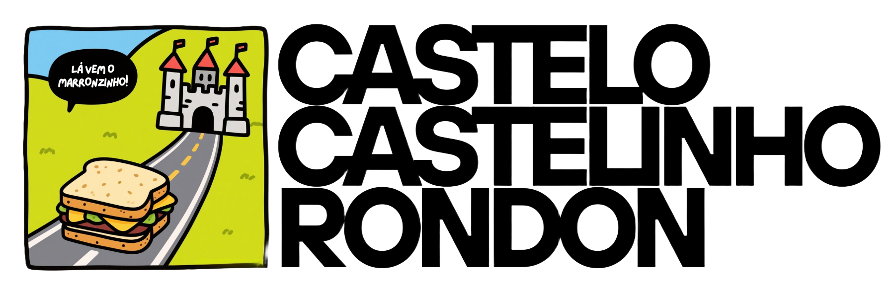

# Bem-vindo ao meu repositório de arquivos e textos

Se você está aqui para baixar algum arquivo ou para ler algum documento que eu te pedi ou te indiquei, simplesmente cace ele aí em cima na lista do repositório e baixe/leia.

---

## Notação TickSig6

Você deve ter observado que todos os arquivos neste repo (à exceção deste, que se chama `README.md`) começam com um número esquisito, mais ou menos assim:

`12.34.56.78.90.12`

Essa notação se chama **TickSig6** e é uma forma fácil de criar nomes, rótulos, etc. para arquivos, pastas, anotações, entre outras unidades que precisam de um nome exclusivo, que segue um padrão coerente e fácil de implementar.

Basicamente, a notação contém um grupo de seis pares de números que equivalem ao dia, mês, ano, hora, minuto e segundo em que o arquivo foi rotulado.

Cada rótulo TickSig6 é único em mão dupla, isto é, todo arquivo tem um único rótulo, e esse rótulo nunca se repete (é exclusivo daquele arquivo).

Então, é relativamente fácil encontrar as coisas aqui no repo. 

Sempre que dá, eu coloco também uma breve descrição do artigo depois do rótulo (às vezes isso não é possível porque eu preciso "chamar" o arquivo em um texto, e aí se eu colocar uma descrição além do rótulo dificulta as coisas).

Se você está com dificuldade para encontrar, pode se guiar pela data (por exemplo, se eu te indiquei um arquivo no dia 01/01/01, então provavelmente o arquivo começará com `01.01.01...` ou um número de data próximo.

---

## Certificação de autenticidade via hash SHA256

Aqui estão os hashes dos arquivos/textos que eu divulgo/assino/componho. **Esta página é a única fonte legítima em que você encontrará hashes de textos cuja autenticidade eu confirmo, por minha conta e responsabilidade.** 
Qualquer outra página, na web ou em redes sociais, eventualmente divulgando hashes em meu nome, **não conta com minha participação** e você deve desconfiar dela (e conferir aqui se o hash está listado; se não estiver, eu não garanto a autoria). Depois da lista de hashes, apresento um breve manual de como conferir a autenticidade de textos via hash SHA256.

 

Nome do arquivo | Hash SHA256
------ | ------
arquivo   | hash

 
 

_Como verificar a autenticidade do texto por meio do seu hash SHA256?_

1. Copie e cole exatamente TODO o conteúdo do texto e NADA ALÉM do conteúdo do texto (do primeiro ao último caractere, nenhum a mais, nenhum a menos —qualquer mínima divergência gerará um hash completamente diferente);
2. Descubra o hash SHA256 desse texto. Provavelmente, a forma mais fácil de fazer isso é por meio de um serviço web tal como este: `https://academo.org/demos/SHA-256-hash-generator/`, bastando colar o que você copiou na caixa de texto exibida. O hash aparecerá automaticamente no campo indicado;
3. Vá até a página `https://github.com/eaglebrain/castelocastelinhorondon` e confira na seção "Certificação de autenticidade via hash SHA256" se o hash para o presente arquivo está lá, e se é idêntico ao que você obteve;
4. Você pode fazer essa conferência "no olho" (conferindo caractere por caractere; dá mais trabalho), ou então usando um diffchecker como este, por exemplo: `https://www.diffchecker.com/`;
5. Se os hashes forem idênticos, o texto é autêntico (legítimo e de minha autoria). Se não for, o texto é apócrifo (falso ou está adulterado).

---

Continua com dúvidas?

Entre em contato comigo:
- (11) 98734-0071
- eaglebrain@gmail.com

Atendo/respondo WhatsApp (e prefiro).

Luís Felipe

