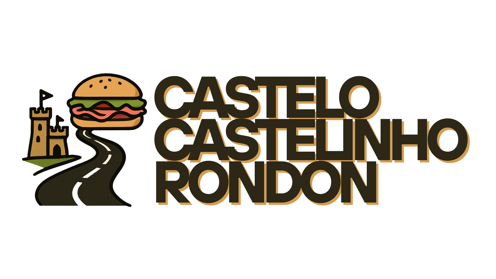

# Bem vindo ao meu repositório de arquivos e textos.

Se você está aqui para baixar algum arquivo ou para ler algum documento que eu te pedi ou te indiquei, simplesmente cace ele aí em cima na lista do repositório e baixe/leia.

---

## Notação TickSig6

Você deve ter observado que todos os arquivos neste repo (à exceção deste, que se chama `README.md`) começam com um número esquisito, mais ou menos assim:

`12.34.56.78.90.12`

Essa notação se chama **TickSig6** e é uma forma fácil de criar nomes, rótulos, etc. para arquivos, pastas, anotações, entre outras unidades que precisam de um nome exclusivo, que segue um padrão coerente e fácil de implementar.

Basicamente, a notação contém um grupo de seis pares de números que equivalem ao dia, mês, ano, hora, minuto e segundo em que o arquivo foi rotulado.

Cada rótulo TickSig6 é único em mão dupla, isto é, todo arquivo tem um único rótulo, e esse rótulo nunca se repete (é exclusivo daquele arquivo).

Então, é relativamente fácil encontrar as coisas aqui no repo. 

Sempre que dá, eu coloco também uma breve descrição do artigo depois do rótulo (às vezes isso não é possível porque eu preciso "chamar" o arquivo em um texto, e aí se eu colocar uma descrição além do rótulo dificulta as coisas).

Se você está com dificuldade para encontrar, pode se guiar pela data (por exemplo, se eu te indiquei um arquivo no dia 01/01/01, então provavelmente o arquivo começará com `01.01.01...` ou um número de data próximo.

---

Continua com dúvidas?

Entre em contato comigo:
- (11) 98734-0071
- eaglebrain@gmail.com

Atendo/respondo WhatsApp (e prefiro).

Luís Felipe
